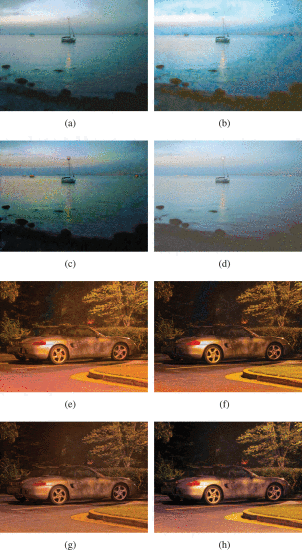

# D2BGAN Model Implementation from scratch

# Paper 

### D2BGAN: A Dark to Bright Image Conversion Model for Quality Enhancement and Analysis Tasks Without Paired Supervision

[D2BGAN Paper](https://ieeexplore.ieee.org/document/9784432)

# Summary of D2BGAN paper

D2BGAN is a CycleGAN model that is designed to convert low light images to bright images. It is an unpaired GAN-based image enhancement operation that uses cycle consistency, geometric consistency, and illumination consistency. The model has been shown to provide competitive results on standard benchmark datasets, and it has been observed to perform well on DICM, LIME, and MEF datasets when D2BGAN was applied. However, it does not perform well on backlit images.

# Difference between conventional CycleGAN and D2BGAN 

In conventional CycleGAN 2 generators and 2 discriminators have been used. 
However, in D2BGAN architecture, 2 generators and 8 discriminators have been used. 

In D2BGAN , 
in each domain, 4 discriminators have been used (8 discriminators altogether)
1. color discriminator 1 
2. color discriminator 2
  - RGB images with 2 blurred factors are passed through these 2 discriminators
3. texture discriminator
  - A grayscale of an image was used for this discriminator 
4. edge discriminator 
  - The edge image which was obtained by [Prewitt operator](https://en.wikipedia.org/wiki/Prewitt_operator) (any edge filter will do) to pass through this discriminator

For the loss, compared to conventional CycleGAN , in addition to Adversarial Loss and Cycle Loss, a new loss "consistency loss" has been introduced which represent geomentric consistency and illumination consistency. 

The idea of illumination consistency is supported by the fact that two same low light images with slightly different illumination can generate the same enhanced image.  The network is guided to a single translation at a time, thereby controlling the open-ended nature of the problem to some extent. in addition, the generalization capability of the network is improved, and false structure generation is reduced.

The geometric consistency acts in a similar fashion and ensures that the false data generation tendency of the generator is checked. 

**These two consistencies consider the structure and illumination factors of the image**, improving
the overall illumination without saturation while preserving the structure at the same time.

To set up the geometric and lighting consistency constraints, we transform X(image in X domain) into X_g and X_l, where X_g is a 90-degree rotation of X and X_l is a gamma transformation of X. 

[Gamma transformation (correction)](https://en.wikipedia.org/wiki/Gamma_correction) is a non-linear operation used to encode and decode luminance or tristimulus values in still image systems.

# D2BGAN Model Architecture

# D2BGAN Dataflow 

# D2BGAN Loss contribution

# D2BGAN Experimental Results

The following are the experimental results of the D2BGAN model by the original authors.

## References

[D2BGAN](https://arts.units.it/retrieve/e2913fdf-656a-f688-e053-3705fe0a67e0/D2BGAN_A_Dark_to_Bright_Image_Conversion_Model_for_Quality_Enhancement_and_Analysis_Tasks_Without_Paired_Supervision.pdf)
